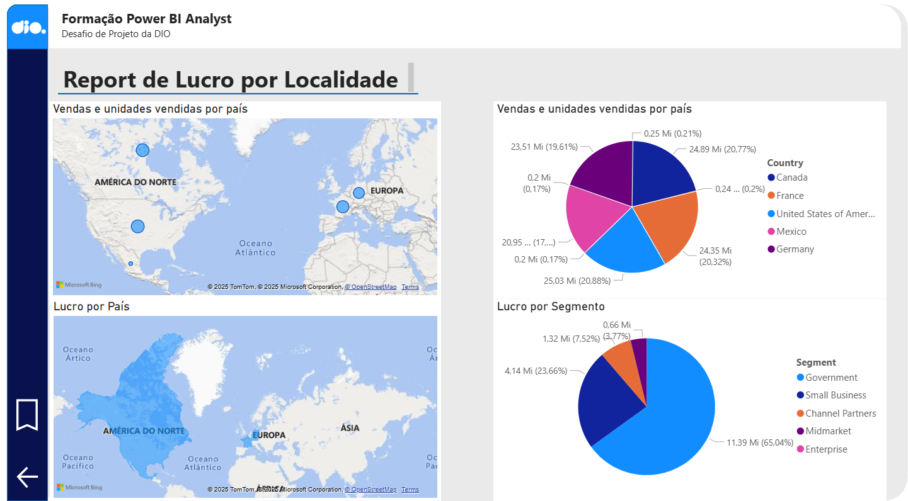

# 📊 Report de Lucro por Localidade — Desafio Power BI Analyst DIO

## 🧩 Sobre o Projeto

Este projeto foi desenvolvido como parte do **Desafio de Projeto da Formação Power BI Analyst** da [DIO (Digital Innovation One)](https://www.dio.me/).  
O objetivo foi **replicar e aprimorar dashboards criados durante o curso** e, em seguida, **criar uma nova página de relatório** no Power BI, aplicando os conceitos aprendidos sobre criação de visuais, medidas e boas práticas de layout.

---

## 🎯 Objetivo do Desafio

O desafio consistia em:
1. Recriar duas páginas de relatório já construídas durante o curso, utilizando a *sample data* disponibilizada.  
2. Criar **uma terceira página própria**, aplicando:
   - Visual de **mapa** com soma de *Sales* e unidades vendidas por país;  
   - Visual de **mapa** com soma de *Profit* (lucro) por país;  
   - Visual de **pizza** exibindo o *Lucro por Segmento*.  

Além disso, era necessário:
- Organizar a disposição dos visuais no relatório;  
- Renomear títulos e legendas de forma clara e contextualizada;  
- Publicar o relatório e exportá-lo para o PowerPoint (ou salvar o arquivo .pbix localmente).

---

## 📍 Estrutura do Relatório

### Página 3 — *Report de Lucro por Localidade*
Os visuais adicionados incluem:

- 🗺️ **Mapa 1:** Vendas e unidades vendidas por país  
  Representa a soma total das vendas e quantidades vendidas em cada país.  

- 🗺️ **Mapa 2:** Lucro por país  
  Mostra a distribuição do lucro agregado em cada região.  

- 🥧 **Gráfico de Pizza:** Lucro por segmento  
  Compara o lucro entre diferentes segmentos de mercado (*Government, Small Business, Channel Partners, Midmarket e Enterprise*).

---

## 💡 Principais Aprendizados

Durante o desenvolvimento deste projeto, foram reforçados os seguintes conceitos:
- Criação e personalização de **visuais interativos** no Power BI;  
- Utilização de **mapas e gráficos de setor** para análises geográficas e comparativas;  
- Aplicação de boas práticas de **layout e nomenclatura**;  
- Interpretação e manipulação de *datasets sample*;  
- Publicação e exportação de relatórios no Power BI Service e PowerPoint.

---

## 🗂️ Arquivos do Repositório

- `Dashboard_Lucro_Localidade.pbix` → Arquivo do projeto Power BI  
- `Report_Lucro_Localidade.png` → Captura do dashboard finalizado  
- `README.md` → Este arquivo de documentação  

---

## 🔗 Recursos Utilizados

- **Power BI Desktop**
- **Dataset Sample disponibilizado pela DIO**
- **Template de referência do curso**
- [Repositório base da DIO](https://github.com/julianazanelatto/power_bi_analyst)

---

## 🏁 Resultado Final

Abaixo, visual do dashboard finalizado:

---

> 🚀 *"Transformar dados em decisões é o poder do analista."*
